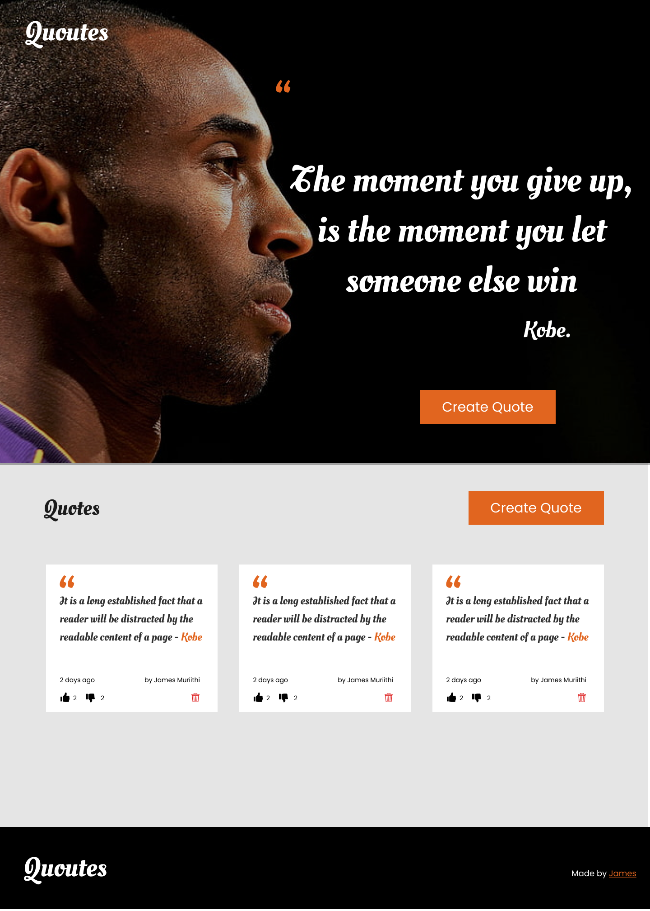
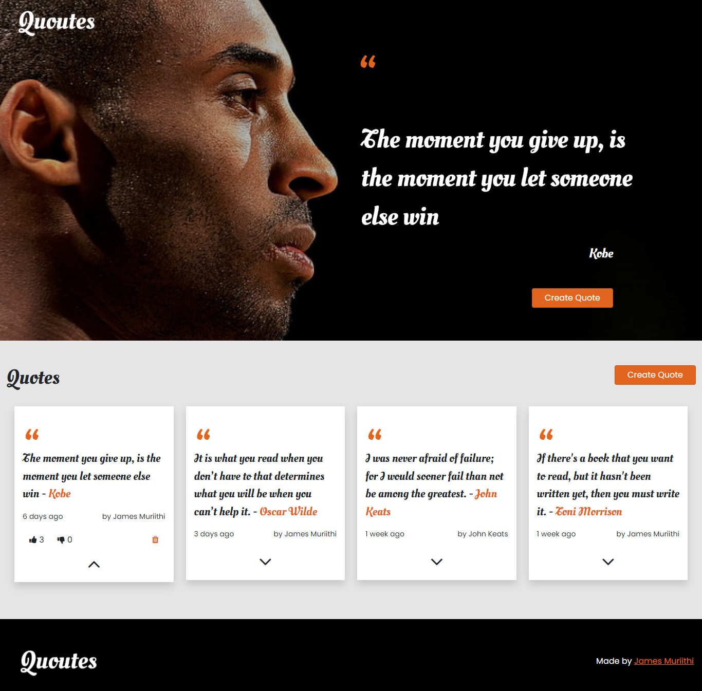

# Angular Quotes App
A simple Quotes App created using Angular
## Description
A web application where user can post quotes and upvote or downvote the quotes. 
## Setup Requirements
* Git
* Web-browser of your choice
* Github
* Angular CLI
* Node.js
* NPM

## How to install

* Clone the repo to your computer
```shell
git clone https://github.com/james-muriithi/ng-quote-app.git
```
* Open terminal and navigate to the directory of the project you just cloned to your computer (ng-quote-app)
* Run the following command to install all the dependencies
``` 
npm install
```
* And the following to start development server
```
npm start
```
* open the browser and navigate to http://localhost:4200/ to see the application in action

## Design

## Screenshots

## Demo
[Visit the link to see the demo of the application](https://james-muriithi.github.io/ng-quote-app/)
## Contact
To make a contribution to the code used or any suggestions you can click on the contact link and email me your suggestions.
* Email: muriithijames123@gmail.com

## Licence
Copyright (c) 2021 Moringa school

Permission is hereby granted, free of charge, to any person obtaining a copy
of this software and associated documentation files , to deal
in the Software without restriction, including without limitation the rights
to use, copy, modify, merge, publish, distribute, sublicense, and/or sell
copies of the Software, and to permit persons to whom the Software is
furnished to do so, subject to the following conditions:

The above copyright notice and this permission notice shall be included in all
copies or substantial portions of the Software.

THE SOFTWARE IS PROVIDED "AS IS", WITHOUT WARRANTY OF ANY KIND, EXPRESS OR
IMPLIED, INCLUDING BUT NOT LIMITED TO THE WARRANTIES OF MERCHANTABILITY,
FITNESS FOR A PARTICULAR PURPOSE AND NONINFRINGEMENT. IN NO EVENT SHALL THE
AUTHORS OR COPYRIGHT HOLDERS BE LIABLE FOR ANY CLAIM, DAMAGES OR OTHER
LIABILITY, WHETHER IN AN ACTION OF CONTRACT, TORT OR OTHERWISE, ARISING FROM,
OUT OF OR IN CONNECTION WITH THE SOFTWARE OR THE USE OR OTHER DEALINGS IN THE
SOFTWARE.